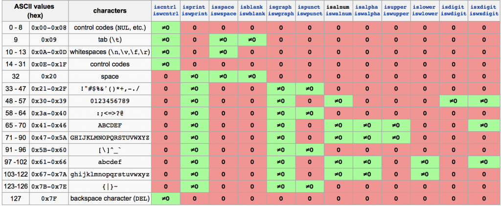

#\#include \<vector\>
1. vector 属于STL (Standard Template Library, 标准模板库)中的一种自定义的数据类型
2. vector 容器与数组相比其优点在于它能够根据需要随时自动调整自身的大小以便容下所要放入的元素
3. 向量的声明与初始化 
```cpp
    vector<int> a ;                                 //声明一个int型向量a
    vector<int> a(10);                              //声明一个初始大小为10的向量
    vector<int> a(10, 1) ;                         //声明一个初始大小为10且初始值为1的向量
    vector<int> b(a) ;                             //声明并用向量a初始化向量b
    vector<int> b(a.begin(), a.begin()+3) ;        //将a向量中从第0个到第2个(共3个)作为向量b的初始值
    int n[] = {1, 2, 3, 4, 5} ;
    vector<int> a(n, n+5) ;              //将数组n的前5个元素作为向量a的初值
    vector<int> a(&n[1], &n[4]) ;        //将n[1] - n[4]范围内的元素作为向量a的初值
```
4. 基本操作

```cpp
    1>. a.size()                 //获取向量中的元素个数

    2>. a.empty()                //判断向量是否为空

    3>. a.clear()                //清空向量中的元素

    4>. 复制
        a = b ;            //将b向量复制到a向量中

    5>. 比较
        保持 ==、!=、>、>=、<、<= 的惯有含义 ;
        如: a == b ;    //a向量与b向量比较, 相等则返回1


    6>. 插入 - insert
        ①、 a.insert(a.begin(), 1000);            //将1000插入到向量a的起始位置前
        
        ②、 a.insert(a.begin(), 3, 1000) ;        //将1000分别插入到向量元素位置的0-2处(共3个元素)
        
        ③、 vector<int> a(5, 1) ;
            vector<int> b(10) ;
            b.insert(b.begin(), a.begin(), a.end()) ;        //将a.begin(), a.end()之间的全部元素插入到b.begin()前

    7>. 删除 - erase
        ①、 b.erase(b.begin()) ;                     //将起始位置的元素删除
        ②、 b.erase(b.begin(), b.begin()+3) ;        //将(b.begin(), b.begin()+3)之间的元素删除

    8>. 交换 - swap
        b.swap(a) ;            //a向量与b向量进行交换
```        
#\#include \<string>
1. 标准库类型，可变长字符序列
2. 声明字符串
```cpp
string s;//调用默认构造函数，s为一个空字符串
string s(str);  //等价于string s = str;调用拷贝构造函数，s是str的备份
string s(str,strindex); //将字符串str内始于strindex位置的部分当作s的初始值
    eg.     string str = "123456789";
            string  s(str,3);//s的初值为str由位置3开始的字符串，即456789
string s(str,stridx,strlen); // 将字符串str由stridx位置起始且长度为strlen的部分最为s的初值，如果strlen大于最大长度，则只截取字符串最大长度
    eg.string s(str,3,10);//s=456789,由位置3开始，截取长度为10的部分，由于str剩余部分长度小于10，则截取str剩余最大长度
string s(cstr);//将C风格字符串作为s的初值
    eg.     string s("hello");//s的初值为hello
string s(cstr,length);//将C风格字符串的length长度部分作为s的初值
    eg.     string s("hello",2);//s="he"
string s(num,c);//生成一个字符串，包含num个c字符
    eg.string s(10,'c');//s的初值为“cccccccccc”
```
3. 常用的操作函数
```cpp
1、=、assign(str,strindex,length)  //用于赋予新值，assign函数用于将一个字符串的部分内容赋值给另一个string对象
eg.     string s1 = "hello";
        string s2;
        s2.assign(s1,0,3);//s2的值为“hel”

2、 swap(str1，str2) //交换两个字符串的内容
eg.     string s1 = "hello";
        string s2 = "world";
        swap(s1,s2);//swap函数将s1和s2的内容交换，现在s1="world",s2="hello"

3、+=、append()、push_back()//在字符串尾部追加内容,"+="可追加string对象，字符以及C风格字符串，append函数则可以追加string对象和C风格字符串，push_back函数则只能追加字符
eg.     string s1 = "hello";
        string s2 = " world";
        s1 += s2;//正确，s1的值为”hello world“
        s1 +="world";// 正确，s1的值为"hello world"
        s1 +='c'; //正确，s1的值为"helloc"

        s1.append(s2);//正确，s1的值为"hello world"
        s1.append(" world");//正确，s1的值为"hello world"
        s1.append('c');//错误，append函数不支持追加字符

        s1.push_back(s2);//错误
        s1.push_back("world");//错误
        s1.push_back('c');//正确

4、 insert()//用于插入字符串
eg.     string s1 = "hello";
        s1.insert(0,"world ");//s1的值为world hello

5、 erase()//用于删除字符的
eg.     string str("This is an example phrase.");
        string::iterator it;//迭代器

        str.erase(10,8);//str的值为"This is an phrase.",删除了从位置10开始的8个字符

        it = str.begin()+9;//迭代器位置为9
        str.erase(it);//删除了从it迭代器位置处的一个字符，str="This is a phrase."

        str.erase(str.begin()+5,str.end()-7);//删除两个参数之间的所有字符，str="This phrase."

6、 clear()函数和~string()  //都是用来删除全部字符的
eg.     str.clear();//删除str的全部字符，此时str为一个空串
        str.~string();//销毁所有字符，释放内存

7、 replace()函数 //用于替换字符
eg.     string line = "this@ is@ a test string!";
        line = line.replace(line.find("@"),1,"");//将line中从find的@位置开始替换一个长度的字符为"" 结果为this is@ a test string!

8、 ==、！=、<、<=、>、>=、compare()//比较字符串
eg.     string s1 = "haha";
        string s2 = "haha";
        if(s1.compare(s2) == 0){
            cout << "相等" << endl;      
        }

9、 size()函数和length()函数，返回字符串的字符数
eg.     string str = "haha";
        str.size() 等于 str.length(),值均为4

10、empty()//判断字符串是否为空

11、下标法str[index]或者str.at(index)获取字符串内指定位置的字符

12、 data()函数，将内容以字符数组的形式返回

注意：

    C++字符串和C字符串的转换
        C++提供的由C++字符串得到对应的C_string的方法是使用data()、c_str()和copy()，其中，data()以字符数组的形式返回字符串内容，但并不添加'\0'.
        c_str()返回一个以'\0'结尾的字符数组
        copy()则把字符串的内容复制或写入已有的c_string或字符数组内
    元素存取
        我们可以使用下标操作符[]和函数at()来对字符串的字符进行访问，但是应该注意的是下标操作符并不会检查索引是否有效，如果索引失效，会引起未定义的行为
        at()函数则会检查索引，如果索引失效会抛出out_of_range异常
        注意，操作符可取到字符串尾部的'\0'字符

class String
{
public:
    String(const char *str = NULL);//普通构造函数
    String(const String &other);//拷贝构造函数
    ~String(void);//析构函数
    
private:
    char *m_data;//用于保存字符串  
};
//普通构造函数
String:String(const char *str)
{
       if(str == NULL){
           m_data = new char[1];
           *m_data = '\0';
       }else{
           int length = strlen(str);
           m_data = new char[length+1];
           strcpy(m_data,str);
       }
}

//析构函数
String::~String(void)
{
    delete []m_data;
}

//拷贝构造函数
String::String(const String& other)
{
    int length = strlen(other.m_data);
    m_data = new char[length+1];
    strcpy(m_data,other.m_data);
}
```
#\#include <unistd.h>
1.  常用函数
```C++
    getuid() //用来取得执行目前进程的用户id
    
    extern char *getcwd (char *__buf, size_t __size) __THROW __wur;//getcwd()会将当前工作目录的绝对路径复制到参数buffer所指的内存空间中,参数size为buf的空间大小
    
    gethostname() ： 返回本地主机的标准主机名。
    
    int gethostname(char *name, size_t len);
    参数说明：
        这个函数需要两个参数：
        接收缓冲区name，其长度必须为len字节或是更长,存获得的主机名。
        接收缓冲区name的最大长度
        返回值：如果函数成功，则返回0。如果发生错误则返回-1。错误号存放在外部变量errno中。

    gethostbyname() 函数说明——用域名或主机名获取IP地址
    包含头文件
    #include <netdb.h>
    #include <sys/socket.h>
    函数原型
    struct hostent *gethostbyname(const char *name);//这个函数的传入值是域名或者主机名，例如"www.google.cn"等等。传出值，是一个hostent的结构。如果函数调用失败，将返回NULL。

    int chdir(const char * path);//函数说明：chdir（）用户将当前的工作目录改变成以参数路径所指的目录。返回值执行成功则返回0，失败返回-1，errno为错误代码

    pid_t waitpid(pid_t pid,int *status,int options)；
        pid>0时，只等待进程ID等于pid的子进程，不管其它已经有多少子进程运行结束退出了，只要指定的子进程还没有结束,waitpid就会一直等下去。
        pid=-1时，等待任何一个子进程退出，没有任何限制，此时waitpid和wait的作用一模一样。 　　
        pid=0时，等待同一个进程组中的任何子进程，如果子进程已经加入了别的进程组，waitpid不会对它做任何理睬。
        pid<-1时，等待一个指定进程组中的任何子进程，这个进程组的ID等于pid的绝对值。
        options: options提供了一些额外的选项来控制waitpid，目前在Linux中只支持WNOHANG和WUNTRACED两个选项，这是两个常数，可以用"|"运算符把它们连接起来使用。
        使用了WNOHANG参数调用waitpid，即使没有子进程退出，它也会立即返回，不会像wait那样永远等下去。
            >>当正常返回的时候，waitpid返回收集到的子进程的进程ID；
            >>如果设置了选项WNOHANG，而调用中waitpid发现没有已退出的子进程可收集，则返回0； 　　 >>如果调用中出错，则返回-1，这时errno会被设置成相应的值以指示错误所在；当pid所指示的子进程不存在，或此进程存在，但不是调用进程的子进程，waitpid就会出错返回，这时errno被设置为ECHILD 
```

#include <stdlib.h>
```c++
    malloc();和free();的基本概念以及基本用法
    void *malloc(long NumBytes);  //该函数分配了NumBytes个字节，并返回了指向这块内存的指针。如果分配失败，则返回一个空指针（NULL）。关于分配失败的原因，应该有多种，比如说空间不足就是一种。
    void free(void *FirstByte);//该函数是将之前用malloc分配的空间还给程序或者是操作系统，也就是释放了这块内存，让它重新得到自由。
```
#\#include <stdio.h>
1.
```C++
    extern int sprintf (char *__restrict __s,const char *__restrict __format, ...) __THROWNL;//sprintf函数打印到字符串中，而printf函数打印输出到屏幕上。sprintf函数在我们完成其他数据类型转换成字符串类型的操作中应用广泛。__restrict __format 是个格式化字符串。

    feof介绍：feof用检测流上的文件结束符，其返回值有两种情况：如果遇到文件结束，函数值为非零值，否则函数值为0
    #define  _IOEOF  0x0010 
    #define  feof(_stream)  ((_stream)->_flag & _IOEOF)

```
#\#include <string.h>
1.
```C++
     int strncmp(const char *str1, const char *str2, size_t n);//把 str1 和 str2 进行比较，最多比较前 n 个字节


```
#include <fcntl.h> 
#include <errno.h>
```c++
    char *strerror(int errnum);从内部数组中搜索错误号 errnum（通常是errno），并返回一个指向错误消息字符串的指针。strerror 生成的错误字符串取决于开发平台和编译器。
```
#\#include <pwd.h>
1. 常用函数
```C++
    struct passwd *getpwnam(const char *name);
    struct passwd *getpwuid(uid_t uid);  //根据用户的用户ID或者登录名,可以通过getpwuid或getpwnam函数获得用户的登录信息
    struct passwd
    {
         char *pw_name;		/* Username.  */
         char *pw_passwd;		/* Password.  */
        __uid_t pw_uid;		/* User ID.  */
         __gid_t pw_gid;		/* Group ID.  */
        char *pw_gecos;		/* Real name.  */
        char *pw_dir;			/* Home directory.  */
        char *pw_shell;		/* Shell program.  */
    };
```
#include <signal.h>
#include <sys/wait.h>
#include <sys/types.h>
#include <sys/stat.h> 

#预编译指令：

1.   
    #空指令，无任何效果
    #include包含一个源代码文件
    #define定义宏
    #undef取消已定义的宏
    #if如果给定条件为真，则编译下面代码
    #ifdef如果宏已经定义，则编译下面代码
    #ifndef如果宏没有定义，则编译下面代码
    #elif如果前面的#if给定条件不为真，当前条件为真，则编译下面代码
    #endif结束一个#if……#else条件编译块
    #error停止编译并显示错误信息


#\#include \<cctype>



    isalpha （字母，包括大写、小写）
    islower（小写字母）
    isupper（大写字母）
    isalnum（字母大写小写+数字）
    isblank（space和\t）
    isspace（space、\t、\r、\n）

