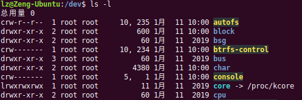

# Linux文件系统
1. 支持多种文件系统包括 ext、ext2、umsdos、msdos、proc、smb、ncp、iso9660、sysv、hpfs、affs、ufs、ntfs 等。 
2. 设备放在/dev
3. 虚拟文件系统 VFS

    1) 设备。       文件系统所在的块设备号。
    2) I 节点指针。  包括 mounted I 节点指针(指向装载的文件系统中第一个 I 节点)和 covered I 节点指针(所挂接的目录的I 节点)。
    3) 数据块大小。   以字节为单位的本文件系统的块的大小。
    4) 超级块操作例程。 指向本文件系统所支持的一些超级块例程的指针。
    5) 文件系统类型。 指向已经 mount 的文件系统的 file_system_type 数据结构的指针。    
    6) 特定文件系统的指针 指向本文件系统所需信息的指针。

4. Linux系统文件类型 ls -l 查看

        普通文件    -
        目录文件    d
        硬链接文件   l    ln命令产生
        符号链接文件       ln -s
        套接字文件   s
        有名管道文件  p     mknod
        字符设备文件  c
        块设备文件   b

    
5. inode

        1) 设备信息:文件使用的设备。
        2) 状态(mode)信息:包含文件的类型及访问权限。
        3) 所有者信息:文件所有者的用户 ID、文件所有者所在的组 ID。
        4) 连接信息(link):指向本 inode 的连接文件的个数。
        5) 文件的大小(size):文件的字节数。
        6) 时间戳(timestamps):上次文件被访问的时(access time)、上次文件被修改的时间(mod time)。
        7) 数据块(datablocks):含指向文件占用的磁盘数据块的指针。前 12 个是直接指针,后 3 个分别指向一级间接块、二级间接块、三级间接块。
    
    建立硬链接文件和建立符号链接文件有什么区别,体现在哪里?
    
    