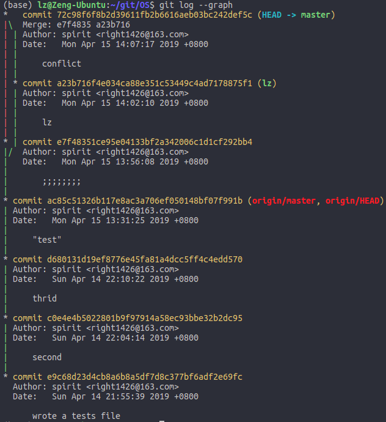
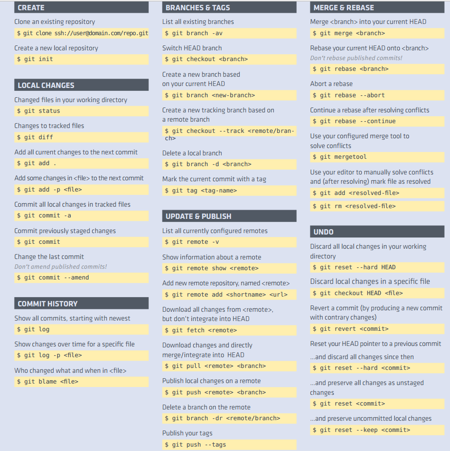

#git
1. 安装
>sudo apt-get install git (ubuntu && debian)
官网下载源码安装：
>./config
>make
>sudo make install
2. 设置git的名字和邮箱
>$ git config --global user.name "Your Name"
>$ git config --global user.email "email@example.com"
3. 初始化仓库
>(base) lz@Zeng-Ubuntu:~/test$ git init
已初始化空的 Git 仓库于 /home/lz/test/.git/
.git，这个目录是Git来跟踪管理版本库
只能跟踪文本文件的改动
4. 用命令git add告诉Git，把文件添加到仓库：
>git add readme.txt
5. 用命令git commit告诉Git，把文件提交到仓库：
>git commit -m "wrote a readme file"
    -m后面输入的是本次提交的说明
为什么Git添加文件需要add，commit一共两步呢？
因为commit可以一次提交很多文件，所以你可以多次add不同的文件。
6. git status 命令可以让我们时刻掌握仓库当前的状态
7. git diff 显示修改前后的差异 git diff HEAD -- readme.txt
8. git log 显示提交日志 git log --pretty=oneline
HEAD：当前版本
HEAD^:上一个版本
HEAD^^:再上一个版本
HEAD～n：第前n个版本
9. 版本回退
>git reset --hard HEAD~n
>git reset --hard d68013(版本号)
10. git reflog 记录每一次命令
11. 暂存区、工作区和版本库
文件夹目录：工作区
目录下的.git文件夹：版本库
在.git文件夹下的index（或stage）称为：暂存区
              master：自动创建的第一个分支
              head：master的一个指针
              
              
              git add 之后
              
              git commit之后
              

12. 撤销修改
 >git checkout -- readme.txt 暂存区前
 >git reset HEAD <file>  暂存区后版本库前
场景1：当你改乱了工作区某个文件的内容，想直接丢弃工作区的修改时，用命令git checkout -- file。
场景2：当你不但改乱了工作区某个文件的内容，还添加到了暂存区时，想丢弃修改，分两步，第一步用命令git reset HEAD <file>，就回到了场景1，第二步按场景1操作。
场景3：已经提交了不合适的修改到版本库时，想要撤销本次提交版本回退
13. 删除文件
>rm wenjian.txt
>git rm wenjain.txt
>git commit
误删还原：git checkout -- test.txt
14. 创建ssh
>ssh-keygen -t rsa -C "youremail@example.com"


15. 将本地仓库推到github
关联远程仓库
>git remote add origin git@github.com:Spirit-style/OS.git
推送master分支所有内容
>git push -u origin master

或在本地新建仓库再推到github
```
echo "# OS" >> README.md
git init
git add README.md
git commit -m "first commit"
git remote add origin git@github.com:Spirit-style/OS.git
git push -u origin master
```
>git push origin master

16. 从远程仓库克隆
>git clone git@github.com:Spirit-style/OS.git

17. 创建分支
> git checkout -b lz    -b：创建并切换
或
>git branch dev
>git checkout dev
18. 查看分支
>git branch
19. 合并分支
>git merge dev 合并指定分支到当前分支
20. 删除分支
>git branch -d dev
21. 合并分支冲突
当Git无法自动合并分支时，就必须首先解决冲突。解决冲突后，再提交，合并完成。
Git用<<<<<<<，=======，>>>>>>>标记出不同分支的内容
>git log --graph --pretty=oneline --abbrev-commit 查看分支合并情况
>it log --graph 查看分支合并图

22. 强制禁用Fast forward
> git merge --no-ff -m "merge with no-ff" dev
23. 存储现场和恢复现场 stash
>git stash
>git stash list 查看存储的现场
恢复
>git stash apply
>git stash drop //删除回复后的stash内容
或
>git stash pop //恢复的同时把stash内容也删了
恢复指定现场
>git stash apply stash@{0}
24. feature 分支
每个新功能一个分支
删除未合并的分支：
> git branch -D name
25. 查看远程库的信息
>git remote
>git remote -v
推送分支
>git push origin dev
26. 抓取分支
本地创建和远程分支对应的分支：
>git checkout -b dev origin/dev
抓取远程最新提交的分支：
>git branch --set-upstream-to=origin/dev dev 指定本地分支与远程分支的链接
>git pull 抓取远程分支

27. 多人协作的工作模式通常是：
    首先，可以试图用git push origin <branch-name>推送自己的修改；
    如果推送失败，则因为远程分支比你的本地更新，需要先用git pull试图合并；
    如果合并有冲突，则解决冲突，并在本地提交；
    没有冲突或者解决掉冲突后，再用git push origin <branch-name>推送就能成功！
git pull提示no tracking information，则说明本地分支和远程分支的链接关系没有创建，用命令:
>git branch --set-upstream-to <branch-name> origin/<branch-name>。
28. Rebase
将分叉提交转变为直线提交
>git rebase
rebase操作的特点：把分叉的提交历史“整理”成一条直线，看上去更直观。缺点是本地的分叉提交已经被修改过了。
rebase操作可以把本地未push的分叉提交历史整理成直线；
rebase的目的是使得我们在查看历史提交的变化时更容易，因为分叉的提交需要三方对比。
29. 标签
创建标签：``git tag name``
查看所有标签：``git tag``
给历史提交打标签：
>git log --pretty=oneline --abbrev-commit  查看历史提交
>git tag name commit_id
查看标签信息：``git show <tagname>``
创建带有说明的标签，用-a指定标签名，-m指定说明文字:``git tag -a v0.1 -m "version 0.1 released" 1094adb``
查看说明文字：``git show <tagname> ``
删除标签：``git tag -d v0.1``
**创建的标签都只存储在本地，不会自动推送到远程。**
推送某个标签到远程，使用命令:``git push origin <tagname>``
一次性推送全部尚未推送到远程的本地标签：``git push origin --tags``
删除远程标签:
      先删除本地标签：``git tag -d v0.9``
      再删除远程标签：`` git push origin :refs/tags/<tagname>``
30. Tips
某些文件放到Git工作目录中，但又不提交它们,在Git工作区的根目录下创建一个特殊的.gitignore文件，然后把要忽略的文件名填进去，Git就会自动忽略这些文件。https://github.com/github/gitignore
忽略文件的原则是：
    忽略操作系统自动生成的文件，比如缩略图等；
    忽略编译生成的中间文件、可执行文件等，也就是如果一个文件是通过另一个文件自动生成的，那自动生成的文件就没必要放进版本库，比如Java编译产生的.class文件；
    忽略你自己的带有敏感信息的配置文件，比如存放口令的配置文件。
```
# Windows:
Thumbs.db
ehthumbs.db
Desktop.ini

# Python:
*.py[cod]
*.so
*.egg
*.egg-info
dist
build

# My configurations:
db.ini
deploy_key_rsa
```
添加.gitignore之后强制添加到git：`` git add -f App.class``
检查.gitignore文件：``git check-ignore``

命令取别名：`` git config --global alias.st status ``将st代替status
``git config --global alias.co checkout``
``git config --global alias.ci commit``
``git config --global alias.br branch``
``git config --global alias.lg "log --color --graph --pretty=format:'%Cred%h%Creset -%C(yellow)%d%Creset %s %Cgreen(%cr) %C(bold blue)<%an>%Creset' --abbrev-commit"``
当前用户的Git配置文件放在用户主目录下的一个隐藏文件.gitconfig


```

   查看分支：git branch
   创建分支：git branch <name>
   切换分支：git checkout <name>
   创建+切换分支：git checkout -b <name>
   合并某分支到当前分支：git merge <name>
   删除分支：git branch -d <name>

开始一个工作区（参见：git help tutorial）
   clone      克隆一个仓库到一个新目录
   init       创建一个空的 Git 仓库或重新初始化一个已存在的仓库

在当前变更上工作（参见：git help everyday）
   add        添加文件内容至索引
   mv         移动或重命名一个文件、目录或符号链接
   reset      重置当前 HEAD 到指定状态
   rm         从工作区和索引中删除文件

检查历史和状态（参见：git help revisions）
   bisect     通过二分查找定位引入 bug 的提交
   grep       输出和模式匹配的行
   log        显示提交日志
   show       显示各种类型的对象
   status     显示工作区状态

扩展、标记和调校您的历史记录
   branch     列出、创建或删除分支
   checkout   切换分支或恢复工作区文件
   commit     记录变更到仓库
   diff       显示提交之间、提交和工作区之间等的差异
   merge      合并两个或更多开发历史
   rebase     在另一个分支上重新应用提交
   tag        创建、列出、删除或校验一个 GPG 签名的标签对象

协同（参见：git help workflows）
   fetch      从另外一个仓库下载对象和引用
   pull       获取并整合另外的仓库或一个本地分支
   push       更新远程引用和相关的对象
```

错误：
(base) lz@Zeng-Ubuntu:~/vscode/Note$ git pull
fatal: 拒绝合并无关的历史
解决：
>git pull origin master --allow-unrelated-histories 忽略版本不同造成的影响

命令汇总图
