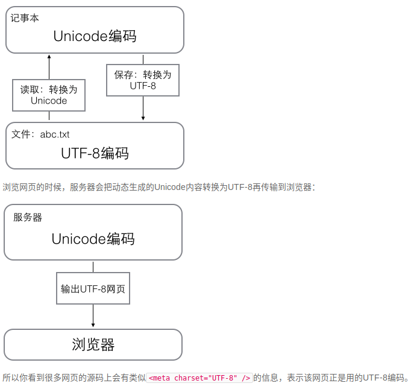

# 基本知识
1. 在计算机内存中，统一使用Unicode编码，当需要保存到硬盘或者需要传输的时候，就转换为UTF-8编码。
   用记事本编辑的时候，从文件读取的UTF-8字符被转换为Unicode字符到内存里，编辑完成后，保存的时候再把Unicode转换为UTF-8保存到文件：
   

2. list 列表 ：A['python', 'java', ‘p’, 'scheme']  A(-1)='scheme';
a. python内置的数据类型，有序的集合
b. 向列表尾插入追加元素 append("xxx"); 
   插入到列表的指定位置 insert(index,"xxxx");
   删除列表末尾元素 pop();
3. tuple 元组 ：A（'python', 'java', p, 'scheme'）  A(-1)='scheme';
a. 初始化之后不允许更改,更加安全，尽可能用元组而不用队列
b. ``t=(1);`` 上式定义的不是tuple，是1这个数！因为括号()既可以表示tuple，又可以表示数学公式中的小括号，产生了歧义，因此，Python规定，这种情况下，按小括号进行计算，计算结果是1。所以，只有1个元素的tuple定义时必须加一个逗号，来消除歧义：``t=(1,);``
4. 选择
```Python
if <条件判断1>:
    <执行1>
elif <条件判断2>:
    <执行2>
elif <条件判断3>:
    <执行3>
else:
    <执行4>
```
5. input() 
a. 返回类型是 string
6. 循环
两种：for name in list 和 while循环
break 和 continue
7. range() 和 list()
生成整数序列 和 将序列转为队列
> list(range(5)) 
>[0, 1, 2, 3, 4]
8. dict 字典：使用键-值（key-value）存储，具有极快的查找速度
a. 形式：{'Michael': 95, 'Bob': 75, 'Tracy': 85} ``d['Michael']=90``
b. 判断key是否在存在
    通过in判断key是否存在：``'Thomas' in d      False``
    通过dict提供的get()方法，如果key不存在，可以返回None
c. dict是用空间来换取时间
d. 删除 pop(key)
9. set
    1. set和dict类似，也是一组key的集合，但不存储value。由于key不能重复，所以，在set中，没有重复的key。
    2. 创建一个set，需要提供一个list作为输入集合
    3. 添加 和 删除 
   add(key);  remove(key);
    4. set可以看成数学意义上的无序和无重复元素的集合，因此，两个set可以做数学意义上的交集、并集等操作
    5. 函数
        a. 函数名是指向一个函数对象的引用，可以把函数名赋给一个变量，相当于给这个函数起了一个“别名”：``a = abs # 变量a指向abs函数a(-1) # 所以也可以通过a调用abs函数1``
        b. 定义函数
            使用def语句，依次写出函数名、括号、括号中的参数和冒号:
```py
def my_abs(x):
    if x >= 0:
        return x
    else:
        return -x
```
        c. pass ：占位符
            pass语句什么都不做，实际上pass可以用来作为占位符，比如现在还没想好怎么写函数的代码，就可以先放一个pass，让代码能运行起来。
        d. isinstance() ：数据类型检查
```py
def my_abs(x):
    if not isinstance(x, (int, float)):
        raise TypeError('bad operand type')
    if x >= 0:
        return x
    else:
        return -x
```
            e. 可以返回多个值，实际是返回了一个元组。
```py
import math

def move(x, y, step, angle=0):
    nx = x + step * math.cos(angle)
    ny = y - step * math.sin(angle)
    return nx, ny

>>> x, y = move(100, 100, 60, math.pi / 6)
>>> print(x, y)
151.96152422706632 70.0

>>> r = move(100, 100, 60, math.pi / 6)
>>> print(r)
(151.96152422706632, 70.0)

```
    定义默认参数要牢记一点：默认参数必须指向不变对象！ 
f.可变参数： def calc(*numbers) 实际传入的是一个元组
  关键字参数：关键字参数允许你传入0个或任意个含参数名的参数，这些关键字参数在函数内部自动组装为一个dict；``def person(name, age, **kw)``
  如果要限制关键字参数的名字，就可以用命名关键字参数：``def person(name, age, *, city, job)``
g. 参数：必选参数、默认参数、可变参数、关键字参数和命名关键字参数
参数定义的顺序必须是：必选参数、默认参数、可变参数、命名关键字参数和关键字参数。
h. 递归函数
**递归函数需要注意防止栈溢出**
解决递归调用栈溢出的方法是通过尾递归优化
尾递归是指，在函数返回的时候，调用自身本身，并且，return语句不能包含表达式。这样，编译器或者解释器就可以把尾递归做优化，使递归本身无论调用多少次，都只占用一个栈帧，不会出现栈溢出的情况。
```py
def fact(n):
    if n==1:
        return 1
    return n * fact(n - 1)

def fact(n):
    return fact_iter(n, 1)

def fact_iter(num, product):
    if num == 1:
        return product
    return fact_iter(num - 1, num * product)

```
##高级特性


